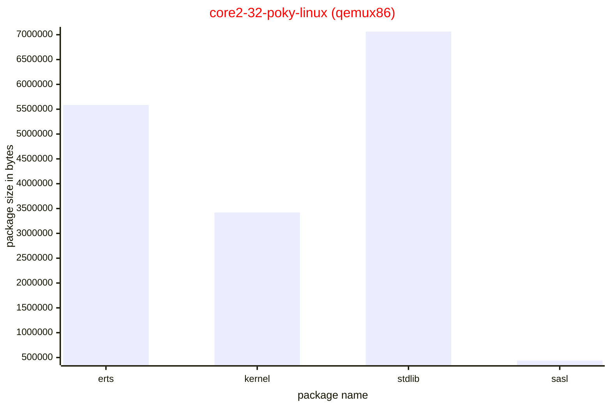
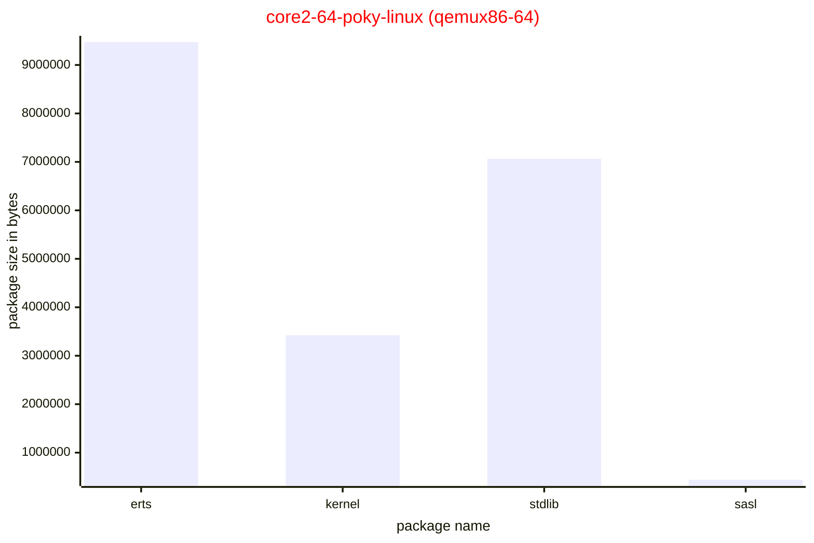
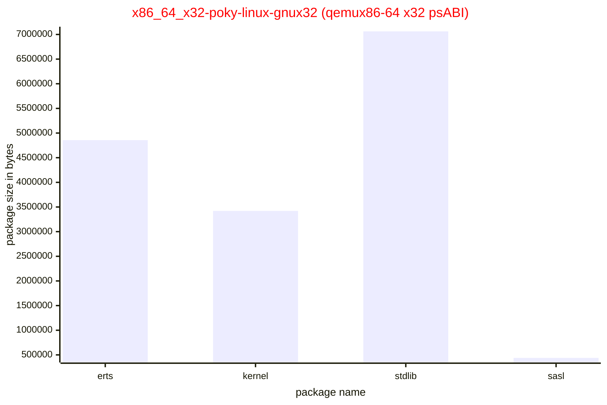
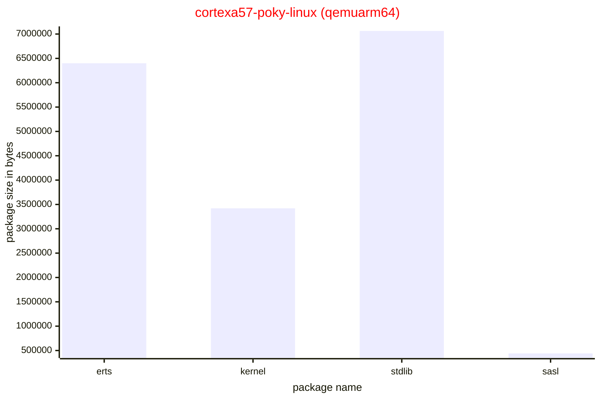
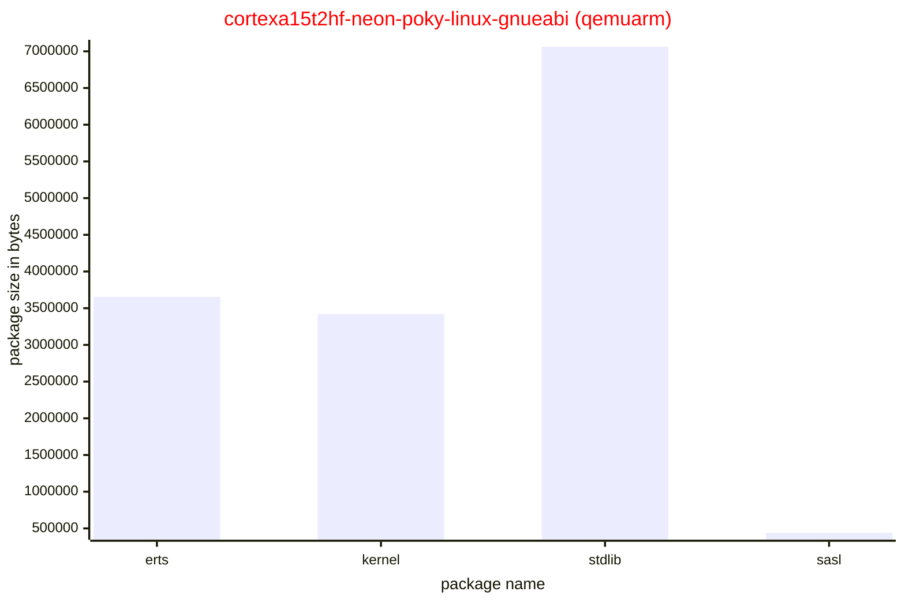

Usually, when designing a linux distribution using YP/OE we want a slim image
with only what we need to run a specific application (or applications). In this
post we'll discuss a bit about erlang and elixir packages that meta-erlang layer
provides.

It's important to know how the packages are divided into smaller ones in order
to offer a better composition when creating linux distributions with YP/OE.

<!-- truncate -->

## Environment setup

1. Cloning all repositories for master branch:

   ```bash
   git clone --branch master git://git.yoctoproject.org/poky
   git clone --branch master https://github.com/openembedded/meta-openembedded.git
   git clone --branch master https://github.com/meta-erlang/meta-erlang
   git clone --branch master https://github.com/meta-erlang/meta-axon
   ```

1. Source the init build environment script:

   ```bash
   cd poky
   source oe-init-build-env ../build
   ```

1. Add the needed layers:

   ```bash
   bitbake-layers add-layer ../meta-openembedded/meta-oe
   bitbake-layers add-layer ../meta-erlang
   bitbake-layers add-layer ../meta-axon
   ```

1. Configure the `conf/local.conf` and enable multiconfig builds:

   ```bash
   tee -a <<EOF
   # debug-tweaks
   EXTRA_IMAGE_FEATURES ?= "debug-tweaks"
   USER_CLASSES ?= "buildhistory buildstats"
   BUILDHISTORY_COMMIT = "1"
   PACKAGE_CLASSES = "package_ipk"
   PATCHRESOLVE = "noop"
   INHERIT += "rm_work"
   RM_WORK_EXCLUDE = "erlang erlang-native nativesdk-erlang"

   # diskmon
   BB_DISKMON_DIRS = "\
       STOPTASKS,${TMPDIR},1G,100K \
       STOPTASKS,${DL_DIR},1G,100K \
       STOPTASKS,${SSTATE_DIR},1G,100K \
       STOPTASKS,/tmp,100M,100K \
       HALT,${TMPDIR},100M,1K \
       HALT,${DL_DIR},100M,1K \
       HALT,${SSTATE_DIR},100M,1K \
       HALT,/tmp,10M,1K"

   # general config
   SDKMACHINE = "x86_64"

   # local
   CONNECTIVITY_CHECK_URIS = "https://www.google.com/"

   # master

   # qemu configuration
   PACKAGECONFIG:append:pn-qemu-system-native = " sdl"
   PACKAGECONFIG:append:pn-qemu-system-native = " gtk+"

   # systemd only
   INIT_MANAGER = "systemd"

   MACHINE ??= "qemuarm"
   DISTRO ??= "poky"
   BBMULTICONFIG ?= "qemux86-64-erlang-elixir qemuarm64-erlang-elixir qemuarm-erlang-elixir qemux86-erlang-elixir qemux86-64-x32-erlang-elixir"

   # To disable QA checks for https://github.com/meta-erlang/meta-erlang/issues/328
   ERROR_QA:remove = "buildpaths"

   EOF
   ```

## multiconfig build

YP/OE provides a smart way to build the same image (or different images) for
multiple targets. It is called multiconfig build and it is fully described at
[Building Images for Multiple Targets Using Multiple Configurations](https://docs.yoctoproject.org/dev-manual/building.html?highlight=multiconfig#building-images-for-multiple-targets-using-multiple-configurations).

Four our context, don't forget to checkout the section
[Environment setup](#environment-setup), we need to compare the erlang and
elixir packages using different processor architectures (_MACHINES_ in YP/OE
language).

We can build five targets using the command below:

```bash
bitbake -c build \
    multiconfig:qemux86-64-erlang-elixir:core-image-minimal \
    multiconfig:qemux86-erlang-elixir:core-image-minimal \
    multiconfig:qemuarm-erlang-elixir:core-image-minimal \
    multiconfig:qemuarm64-erlang-elixir:core-image-minimal \
    multiconfig:qemux86-64-x32-erlang-elixir:core-image-minimal

```

The multiconfig build was configured to create a specific TMPDIR for each
processor architecture. Then, the final results at build folder will be one
folder for each architecture:

```bash
tmp-qemuarm64-glibc-erlang-elixir
tmp-qemuarm-glibc-erlang-elixir
tmp-qemux86-64-glibc-erlang-elixir
tmp-qemux86-64-glibc-x32-erlang-elixir
tmp-qemux86-glibc-erlang-elixir
```

That way, it's easy to navigate into the final output files.

## Introspection with buildhistory

The buildhistory is a YP/OE feature that writes some meta data into a git
repository for further inspection. Then, it's possible check and interact with
files using standard linux tools like find and grep to collect insights. Using
buildhistory is a shortcut because we can inspect how files would be installed
into the final image, without having to burn the image and boot it on a real (or
virtual) target.

<!-- prettier-ignore-start -->
:::note
Check out the
[Enabling and Disabling Build History](https://docs.yoctoproject.org/5.0.3/dev-manual/build-quality.html?highlight=buildhistory#enabling-and-disabling-build-history)
instructions for how to enable buildhistory.
:::
<!-- prettier-ignore-end -->

In this post we are interested in check the size of erlang and elixir packages.

After a success build and from the YP/OE build folder, it's possible to explore
the buildhistory git repository:

```bash
cd buildhistory/packages/cortexa57-poky-linux/erlang
find -name latest -print0 | xargs -0 grep PKGSIZE | sort
...

cd -
cd buildhistory/packages/cortexa57-poky-linux/elixir
find -name latest -print0 | xargs -0 grep PKGSIZE | sort
...
```

`PKGSIZE` gives to us the size in bytes of the final packages generated by
erlang and elixir recipes.

## YP/OE packaging for erlang and elixir recipes

The nature of Erlang/OTP is to isolate erlang modules into applications. The
Erlang/OTP source code embraces this philosophy and it is natural to transform
each application into an installed package (IPK, DEB, RPM). For that,
meta-erlang uses a simple script that creates a recipe manifest (see
[erlang recipe manifest](https://github.com/meta-erlang/meta-erlang/blob/cb94887c108b63c6cba290cb019468f246df5ea4/scripts/contrib/erlang/generate-manifest#L76)
for details).

An erlang recipe manifest, for example
[erlang-27.1-manifest.inc](https://github.com/meta-erlang/meta-erlang/blob/cb94887c108b63c6cba290cb019468f246df5ea4/recipes-devtools/erlang/erlang-27.1-manifest.inc),
declares each Erlang/OTP application. For each application there are five
packages:

- `application_name-doc`: documentation, man pages and examples
- `application_name-dbg`: debug symbols, if any
- `application_name-dev`: development C headers, shared libraries (\*.so)
- `application_name-staticdev`: static libraries (\*.a)
- `application_name`: BEAM modules and files from `priv` folder

Where `application_name` is the name of the application like: kernel, stdlib,
sasl, ...

This separation is necessary because YP/OE splits the package of any recipe into
doc, dbg, dev and staticdev. Then, the user have more control about what will be
installed into the final image.

The elixir recipe follows the same way, but simpler (check out the
[elixir.inc](https://github.com/meta-erlang/meta-erlang/blob/cb94887c108b63c6cba290cb019468f246df5ea4/recipes-devtools/elixir/elixir.inc)
include file).

### Special metapackages

As there are many packages for erlang and elixir, sometimes we need to setup a
development environment will all erlang and elixir packages installed. Or a
minimum set of packages. There are a couple of metapackages created for that
purpose:

- erlang-modules: install _all_ Erlang/OTP applications
- erlang-modules-dev: install _all_ Erlang/OTP applications development packages
- elixir-modules: install _all_ elixir applications
- elixir-modules-dev: install _all_ elixir applications development packages
- erlang: install the minimal Erlang/OTP applications
- elixir: install the minimal elixir applications

### Where the files get installed ?

The best way to awnser this is to take a look into buildhistory data.

At the build folder there is a folder called buildhistory. That folder is split
by images and packages. And for each architecture, there is a specific folder.
So, let's check the first 20 lines from file: files-in-packages.txt for
erlang-erts package:

```bash
head -n 20 buildhistory/packages/core2-32-poky-linux/erlang/erlang-erts/files-in-package.txt
drwxr-xr-x root       root             4096 ./usr
drwxr-xr-x root       root             4096 ./usr/bin
lrwxrwxrwx root       root               22 ./usr/bin/epmd -> ../lib/erlang/bin/epmd
lrwxrwxrwx root       root               21 ./usr/bin/erl -> ../lib/erlang/bin/erl
lrwxrwxrwx root       root               25 ./usr/bin/escript -> ../lib/erlang/bin/escript
lrwxrwxrwx root       root               25 ./usr/bin/run_erl -> ../lib/erlang/bin/run_erl
lrwxrwxrwx root       root               24 ./usr/bin/to_erl -> ../lib/erlang/bin/to_erl
drwxr-xr-x root       root             4096 ./usr/lib
drwxr-xr-x root       root             4096 ./usr/lib/erlang
drwxr-xr-x root       root             4096 ./usr/lib/erlang/bin
lrwxrwxrwx root       root               21 ./usr/lib/erlang/bin/epmd -> ../erts-15.1/bin/epmd
-rwxr-xr-x root       root             1474 ./usr/lib/erlang/bin/erl
-rwxr-xr-x root       root           140752 ./usr/lib/erlang/bin/erl_call
-rwxr-xr-x root       root            38456 ./usr/lib/erlang/bin/escript
-rw-r--r-- root       root             6860 ./usr/lib/erlang/bin/no_dot_erlang.boot
-rwxr-xr-x root       root            25996 ./usr/lib/erlang/bin/run_erl
-rwxr-xr-x root       root             1745 ./usr/lib/erlang/bin/start
-rw-r--r-- root       root             6885 ./usr/lib/erlang/bin/start.boot
-rw-r--r-- root       root             6885 ./usr/lib/erlang/bin/start_clean.boot
-rwxr-xr-x root       root             1244 ./usr/lib/erlang/bin/start_erl
```

## erlang package sizes

When installing the metapackage called `erlang` the following packages will be
automatically installed:

- erlang-erts
- erlang-kernel
- erlang-stdlib
- erlang-sasl

These packages are the basic ones needed in order to run Erlang programs.

<!-- prettier-ignore-start -->
:::note
Actually, your application is in charge of making a proper Erlang/OTP
release. Installing the package `erlang` is an option if you need it installed
into standard locations. Otherwise, your application should produce a valide
release with a builtin ERTS inside.
:::
<!-- prettier-ignore-end -->

The following charts are listed below to get a view about the size of those
basic erlang packages.

The difference between each build, besides the processor architecture, is the
size in bytes of the package erlang-erts. That makes sense because that package
is the ERTS (which is architecture dependent, like word size). On other hand,
the packages kernel, stdlib, sasl have the same size across all builds.

### qemux86

```bash
bitbake -c build multiconfig:qemux86-erlang-elixir:core-image-minimal
```



### qemux86-64

```bash
bitbake -c build multiconfig:qemux86-64-erlang-elixir:core-image-minimal
```



### qemux86-64 with x32 psABI

```bash
bitbake -c build multiconfig:x86_64_x32-poky-linux-gnux32:core-image-minimal
```

<!-- prettier-ignore-start -->
:::note
Enabling x32 psABI should be considered if your application needs to
handle 64-bit features, but you can't afford wasting space with addressing. See
the blog post [Exploring x32 psABI for Erlang/OTP](/blog/2023/09/02/index).

The package size difference in bytes between x32 build and a normal x86-64
is 4615556.
:::
<!-- prettier-ignore-end -->



### qemuarm64

```bash
bitbake -c build multiconfig:qemuarm64-erlang-elixir:core-image-minimal
```



### qemuarm

```bash
bitbake -c build multiconfig:qemuarm-erlang-elixir:core-image-minimal
```



## elixir package sizes

When installing the metapackage called `elixir` the following packages will be
automatically installed:

- erlang (see [erlang package size for details](#erlang-package-sizes))
- erlang-compiler

That is because elixir package needs erlang (erts, kernel, stdlib and sasl)
installed. And, the erlang compiler is also a requirement.

<!-- prettier-ignore-start -->
:::note
Again, your application should manage a release for best results.
Installing the package `elixir` only makes sense for testing purposes.
:::
<!-- prettier-ignore-end -->

The following table summarizes the packages sizes per processor architecture.

| Processor architecture                | Package size in bytes |
| ------------------------------------- | --------------------- |
| core2-32-poky-linux (qemux86)         | 5760108               |
| core2-64-poky-linux (qemux86-64)      | 5760368               |
| qemux86-64-x32-erlang-elixir          | 5763392               |
| cortexa57-poky-linux (qemuarm64)      | 5760476               |
| cortexa15t2hf-neon-poky-linux-gnueabi | 5764076               |

There are slight size differences. It should not as there is no architecture
dependency on elixir beam files.
