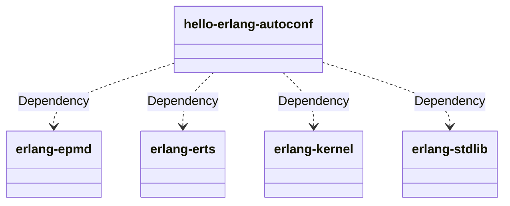
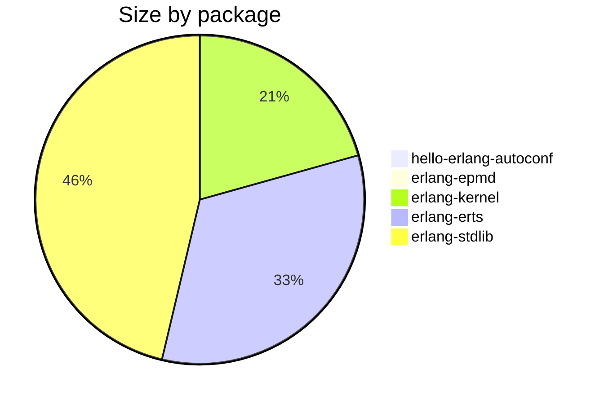

The
[hello-erlang-autoconf](https://github.com/meta-erlang/hello-world/tree/master/hello-erlang-autoconf)
repository is an example about how to use autotools as build tool for Erlang/OTP
projects. The original code came from https://github.com/sirbeancounter/hello. I
just adapted it and fixed small issues for Yocto integration.

<!-- truncate -->

The result was the creating of a recipe called
[hello-erlang-autoconf](https://github.com/meta-erlang/meta-erlang/blob/master/recipes-examples/hello-erlang-autoconf/hello-erlang-autoconf_0.1.0.bb)
as an example about how to integrate autotools with erlang build. This recipe is
very interesting because it inherit the class `autotools` which is a standard
class from openembedded-core.

autotools provides support for building Erlang projects:
[Erlang-Libraries](https://www.gnu.org/software/autoconf/manual/autoconf-2.72/html_node/Erlang-Libraries.html)
and I've found a talk about:
[Using GNU Autoconf to Configure Erlang Programs](https://erlang.org/euc/06/proceedings/1430Lenglet.ppt).
It looks like using autotools is something that could save time as build tool.

I think the final result for the recipe
[hello-erlang-autoconf](https://github.com/meta-erlang/meta-erlang/blob/master/recipes-examples/hello-erlang-autoconf/hello-erlang-autoconf_0.1.0.bb)
was very short and easy to customize. Moreover, as autotools is pretty standard
for configuring and building software package it brings solid foundations too.

I'm not saying that autotools is easy to learn or it is the best tool. But
something to consider.

After building the recipe `bitbake hello-erlang-autoconf` and with buildhistory
enabled it is possible to inspect the size of each dependency.

:::note

Enabled in `local.conf`:

```
USER_CLASSES ?= "buildhistory buildstats"
BUILDHISTORY_COMMIT = "1"
```

:::

Starting with _hello-erlang-autoconf_ package it says:

```bash
$ cat buildhistory/packages/riscv32imafdc-poky-linux/hello-erlang-autoconf/hello-erlang-autoconf/latest
PV = 0.1.0+git
PR = r0
PKGV = 0.1.0+git0+6c7f37489e
RPROVIDES =
RDEPENDS = erlang-epmd erlang-erts erlang-kernel erlang-stdlib
RRECOMMENDS =
PKGSIZE = 12705
FILES = /usr/lib/erlang/lib/hello-*/ebin /etc/hello.d /etc/hello.d/hello.boot /etc/init.d/hello.otp.system /usr/bin/hello.start /usr/bin/hello.stop
FILELIST = /etc/hello.d/hello.boot /etc/hello.d/hello.config /etc/init.d/hello.otp.system /usr/bin/hello.start /usr/bin/hello.stop /usr/lib/erlang/lib/hello-6c7f374/ebin/hello.app /usr/lib/erlang/lib/hello-6c7f374/ebin/hello.beam /usr/lib/erlang/lib/hello-6c7f374/ebin/hello_app.beam /usr/lib/erlang/lib/hello-6c7f374/ebin/hello_sup.beam
```

Looking into `RDEPENDS` it is clear what are necessary to be installed in order
to run hello-erlang-autoconf application:



A close look into all installed files by hellor-erlang-autoconf:

```bash
$ cat buildhistory/packages/riscv32imafdc-poky-linux/hello-erlang-autoconf/hello-erlang-autoconf/files-in-package.txt
drwxr-xr-x root       root             4096 ./etc
drwxr-xr-x root       root             4096 ./etc/hello.d
-rw-r--r-- root       root             7550 ./etc/hello.d/hello.boot
-rwxr-xr-x root       root               63 ./etc/hello.d/hello.config
drwxr-xr-x root       root             4096 ./etc/init.d
-rwxr-xr-x root       root             1525 ./etc/init.d/hello.otp.system
drwxr-xr-x root       root             4096 ./usr
drwxr-xr-x root       root             4096 ./usr/bin
-rwxr-xr-x root       root              370 ./usr/bin/hello.start
-rwxr-xr-x root       root              506 ./usr/bin/hello.stop
drwxr-xr-x root       root             4096 ./usr/lib
drwxr-xr-x root       root             4096 ./usr/lib/erlang
drwxr-xr-x root       root             4096 ./usr/lib/erlang/lib
drwxr-xr-x root       root             4096 ./usr/lib/erlang/lib/hello-6c7f374
drwxr-xr-x root       root             4096 ./usr/lib/erlang/lib/hello-6c7f374/ebin
-rw-r--r-- root       root              231 ./usr/lib/erlang/lib/hello-6c7f374/ebin/hello.app
-rw-r--r-- root       root              636 ./usr/lib/erlang/lib/hello-6c7f374/ebin/hello_app.beam
-rw-r--r-- root       root             1024 ./usr/lib/erlang/lib/hello-6c7f374/ebin/hello.beam
-rw-r--r-- root       root              800 ./usr/lib/erlang/lib/hello-6c7f374/ebin/hello_sup.beam
```

A few files. Just .beam objects and start scripts. An interesting fact, the
following files:

```bash
drwxr-xr-x root       root             4096 ./usr/lib/erlang/lib/hello-6c7f374
drwxr-xr-x root       root             4096 ./usr/lib/erlang/lib/hello-6c7f374/ebin
-rw-r--r-- root       root              231 ./usr/lib/erlang/lib/hello-6c7f374/ebin/hello.app
-rw-r--r-- root       root              636 ./usr/lib/erlang/lib/hello-6c7f374/ebin/hello_app.beam
-rw-r--r-- root       root             1024 ./usr/lib/erlang/lib/hello-6c7f374/ebin/hello.beam
-rw-r--r-- root       root              800 ./usr/lib/erlang/lib/hello-6c7f374/ebin/hello_sup.beam
```

Get installed inside _/usr/lib/erlang/lib/_, this is where the standard
Erlang/OTP is installed by erlang recipe from meta-erlang layer.

More details about all erlang-\* dependencies:

```bash
$ cat buildhistory/packages/riscv32imafdc-poky-linux/erlang/erlang-epmd/latest
PV = 28.0.1
PR = r0
RPROVIDES =
RDEPENDS = base-files base-passwd glibc (>= 2.41+git0+6e489c17f8) libsystemd (>= 257.6) shadow
RRECOMMENDS =
PKGSIZE = 47150
FILES = /usr/lib/erlang/erts-*/bin/epmd /usr/lib/erlang/bin/epmd /usr/bin/epmd /usr/lib/systemd/system/epmd.service /usr/lib/systemd/system/epmd.socket /etc/init.d /usr/lib/systemd/system-preset/98-erlang-epmd.preset /usr/lib/systemd/system/epmd.service /usr/lib/systemd/system/epmd.socket
FILELIST = /usr/bin/epmd /usr/lib/erlang/bin/epmd /usr/lib/erlang/erts-16.0.1/bin/epmd /usr/lib/systemd/system-preset/98-erlang-epmd.preset /usr/lib/systemd/system/epmd.service /usr/lib/systemd/system/epmd.socket
```

```bash
$ cat buildhistory/packages/riscv32imafdc-poky-linux/erlang/erlang-erts/latest
PV = 28.0.1
PR = r0
RPROVIDES =
RDEPENDS = glibc (>= 2.41+git0+6e489c17f8) ncurses-libtinfo (>= 6.5) zlib (>= 1.3.1)
RRECOMMENDS =
PKGSIZE = 4690380
FILES = /usr/bin /usr/lib/erlang/releases /usr/lib/erlang/bin /usr/lib/erlang/erts-*/bin /usr/lib/erlang/lib/erts-*/ebin
FILELIST = /usr/bin/erl /usr/bin/escript /usr/bin/run_erl /usr/bin/to_erl /usr/lib/erlang/bin/erl /usr/lib/erlang/bin/erl_call /usr/lib/erlang/bin/escript /usr/lib/erlang/bin/no_dot_erlang.boot /usr/lib/erlang/bin/run_erl /usr/lib/erlang/bin/start /usr/lib/erlang/bin/start.boot /usr/lib/erlang/bin/start.script /usr/lib/erlang/bin/start_clean.boot /usr/lib/erlang/bin/start_erl /usr/lib/erlang/bin/start_sasl.boot /usr/lib/erlang/bin/to_erl /usr/lib/erlang/erts-16.0.1/bin/beam.smp /usr/lib/erlang/erts-16.0.1/bin/dyn_erl /usr/lib/erlang/erts-16.0.1/bin/erl /usr/lib/erlang/erts-16.0.1/bin/erl.src /usr/lib/erlang/erts-16.0.1/bin/erl_call /usr/lib/erlang/erts-16.0.1/bin/erl_child_setup /usr/lib/erlang/erts-16.0.1/bin/erlexec /usr/lib/erlang/erts-16.0.1/bin/escript /usr/lib/erlang/erts-16.0.1/bin/heart /usr/lib/erlang/erts-16.0.1/bin/inet_gethost /usr/lib/erlang/erts-16.0.1/bin/run_erl /usr/lib/erlang/erts-16.0.1/bin/start /usr/lib/erlang/erts-16.0.1/bin/start.src /usr/lib/erlang/erts-16.0.1/bin/start_erl.src /usr/lib/erlang/erts-16.0.1/bin/to_erl /usr/lib/erlang/releases/28/OTP_VERSION /usr/lib/erlang/releases/28/installed_application_versions /usr/lib/erlang/releases/28/no_dot_erlang.boot /usr/lib/erlang/releases/28/no_dot_erlang.rel /usr/lib/erlang/releases/28/no_dot_erlang.script /usr/lib/erlang/releases/28/start.boot /usr/lib/erlang/releases/28/start.script /usr/lib/erlang/releases/28/start_all_example.rel /usr/lib/erlang/releases/28/start_clean.boot /usr/lib/erlang/releases/28/start_clean.rel /usr/lib/erlang/releases/28/start_clean.script /usr/lib/erlang/releases/28/start_sasl.boot /usr/lib/erlang/releases/28/start_sasl.rel /usr/lib/erlang/releases/28/start_sasl.script /usr/lib/erlang/releases/RELEASES /usr/lib/erlang/releases/RELEASES.src /usr/lib/erlang/releases/start_erl.data
```

```bash
$ cat buildhistory/packages/riscv32imafdc-poky-linux/erlang/erlang-kernel/latest
PV = 28.0.1
PR = r0
RPROVIDES =
RDEPENDS =
RRECOMMENDS =
PKGSIZE = 2931802
FILES = /usr/lib/erlang/lib/kernel-*
FILELIST = /usr/lib/erlang/lib/kernel-10.3.1/ebin/application.beam /usr/lib/erlang/lib/kernel-10.3.1/ebin/application_controller.beam /usr/lib/erlang/lib/kernel-10.3.1/ebin/application_master.beam /usr/lib/erlang/lib/kernel-10.3.1/ebin/application_starter.beam /usr/lib/erlang/lib/kernel-10.3.1/ebin/auth.beam /usr/lib/erlang/lib/kernel-10.3.1/ebin/code.beam /usr/lib/erlang/lib/kernel-10.3.1/ebin/code_server.beam /usr/lib/erlang/lib/kernel-10.3.1/ebin/disk_log.beam /usr/lib/erlang/lib/kernel-10.3.1/ebin/disk_log_1.beam /usr/lib/erlang/lib/kernel-10.3.1/ebin/disk_log_server.beam /usr/lib/erlang/lib/kernel-10.3.1/ebin/disk_log_sup.beam /usr/lib/erlang/lib/kernel-10.3.1/ebin/dist_ac.beam /usr/lib/erlang/lib/kernel-10.3.1/ebin/dist_util.beam /usr/lib/erlang/lib/kernel-10.3.1/ebin/erl_boot_server.beam /usr/lib/erlang/lib/kernel-10.3.1/ebin/erl_compile_server.beam /usr/lib/erlang/lib/kernel-10.3.1/ebin/erl_ddll.beam /usr/lib/erlang/lib/kernel-10.3.1/ebin/erl_debugger.beam /usr/lib/erlang/lib/kernel-10.3.1/ebin/erl_distribution.beam /usr/lib/erlang/lib/kernel-10.3.1/ebin/erl_epmd.beam /usr/lib/erlang/lib/kernel-10.3.1/ebin/erl_erts_errors.beam /usr/lib/erlang/lib/kernel-10.3.1/ebin/erl_kernel_errors.beam /usr/lib/erlang/lib/kernel-10.3.1/ebin/erl_reply.beam /usr/lib/erlang/lib/kernel-10.3.1/ebin/erl_signal_handler.beam /usr/lib/erlang/lib/kernel-10.3.1/ebin/erpc.beam /usr/lib/erlang/lib/kernel-10.3.1/ebin/error_handler.beam /usr/lib/erlang/lib/kernel-10.3.1/ebin/error_logger.beam /usr/lib/erlang/lib/kernel-10.3.1/ebin/erts_debug.beam /usr/lib/erlang/lib/kernel-10.3.1/ebin/file.beam /usr/lib/erlang/lib/kernel-10.3.1/ebin/file_io_server.beam /usr/lib/erlang/lib/kernel-10.3.1/ebin/file_server.beam /usr/lib/erlang/lib/kernel-10.3.1/ebin/gen_sctp.beam /usr/lib/erlang/lib/kernel-10.3.1/ebin/gen_tcp.beam /usr/lib/erlang/lib/kernel-10.3.1/ebin/gen_tcp_socket.beam /usr/lib/erlang/lib/kernel-10.3.1/ebin/gen_udp.beam /usr/lib/erlang/lib/kernel-10.3.1/ebin/gen_udp_socket.beam /usr/lib/erlang/lib/kernel-10.3.1/ebin/global.beam /usr/lib/erlang/lib/kernel-10.3.1/ebin/global_group.beam /usr/lib/erlang/lib/kernel-10.3.1/ebin/global_search.beam /usr/lib/erlang/lib/kernel-10.3.1/ebin/group.beam /usr/lib/erlang/lib/kernel-10.3.1/ebin/group_history.beam /usr/lib/erlang/lib/kernel-10.3.1/ebin/heart.beam /usr/lib/erlang/lib/kernel-10.3.1/ebin/inet.beam /usr/lib/erlang/lib/kernel-10.3.1/ebin/inet6_sctp.beam /usr/lib/erlang/lib/kernel-10.3.1/ebin/inet6_tcp.beam /usr/lib/erlang/lib/kernel-10.3.1/ebin/inet6_tcp_dist.beam /usr/lib/erlang/lib/kernel-10.3.1/ebin/inet6_udp.beam /usr/lib/erlang/lib/kernel-10.3.1/ebin/inet_config.beam /usr/lib/erlang/lib/kernel-10.3.1/ebin/inet_db.beam /usr/lib/erlang/lib/kernel-10.3.1/ebin/inet_dns.beam /usr/lib/erlang/lib/kernel-10.3.1/ebin/inet_dns_tsig.beam /usr/lib/erlang/lib/kernel-10.3.1/ebin/inet_epmd_dist.beam /usr/lib/erlang/lib/kernel-10.3.1/ebin/inet_epmd_socket.beam /usr/lib/erlang/lib/kernel-10.3.1/ebin/inet_gethost_native.beam /usr/lib/erlang/lib/kernel-10.3.1/ebin/inet_hosts.beam /usr/lib/erlang/lib/kernel-10.3.1/ebin/inet_parse.beam /usr/lib/erlang/lib/kernel-10.3.1/ebin/inet_res.beam /usr/lib/erlang/lib/kernel-10.3.1/ebin/inet_sctp.beam /usr/lib/erlang/lib/kernel-10.3.1/ebin/inet_tcp.beam /usr/lib/erlang/lib/kernel-10.3.1/ebin/inet_tcp_dist.beam /usr/lib/erlang/lib/kernel-10.3.1/ebin/inet_udp.beam /usr/lib/erlang/lib/kernel-10.3.1/ebin/kernel.app /usr/lib/erlang/lib/kernel-10.3.1/ebin/kernel.appup /usr/lib/erlang/lib/kernel-10.3.1/ebin/kernel.beam /usr/lib/erlang/lib/kernel-10.3.1/ebin/kernel_config.beam /usr/lib/erlang/lib/kernel-10.3.1/ebin/kernel_refc.beam /usr/lib/erlang/lib/kernel-10.3.1/ebin/local_tcp.beam /usr/lib/erlang/lib/kernel-10.3.1/ebin/local_udp.beam /usr/lib/erlang/lib/kernel-10.3.1/ebin/logger.beam /usr/lib/erlang/lib/kernel-10.3.1/ebin/logger_backend.beam /usr/lib/erlang/lib/kernel-10.3.1/ebin/logger_config.beam /usr/lib/erlang/lib/kernel-10.3.1/ebin/logger_disk_log_h.beam /usr/lib/erlang/lib/kernel-10.3.1/ebin/logger_filters.beam /usr/lib/erlang/lib/kernel-10.3.1/ebin/logger_formatter.beam /usr/lib/erlang/lib/kernel-10.3.1/ebin/logger_h_common.beam /usr/lib/erlang/lib/kernel-10.3.1/ebin/logger_handler.beam /usr/lib/erlang/lib/kernel-10.3.1/ebin/logger_handler_watcher.beam /usr/lib/erlang/lib/kernel-10.3.1/ebin/logger_olp.beam /usr/lib/erlang/lib/kernel-10.3.1/ebin/logger_proxy.beam /usr/lib/erlang/lib/kernel-10.3.1/ebin/logger_server.beam /usr/lib/erlang/lib/kernel-10.3.1/ebin/logger_simple_h.beam /usr/lib/erlang/lib/kernel-10.3.1/ebin/logger_std_h.beam /usr/lib/erlang/lib/kernel-10.3.1/ebin/logger_sup.beam /usr/lib/erlang/lib/kernel-10.3.1/ebin/net.beam /usr/lib/erlang/lib/kernel-10.3.1/ebin/net_adm.beam /usr/lib/erlang/lib/kernel-10.3.1/ebin/net_kernel.beam /usr/lib/erlang/lib/kernel-10.3.1/ebin/os.beam /usr/lib/erlang/lib/kernel-10.3.1/ebin/pg.beam /usr/lib/erlang/lib/kernel-10.3.1/ebin/pg2.beam /usr/lib/erlang/lib/kernel-10.3.1/ebin/prim_tty.beam /usr/lib/erlang/lib/kernel-10.3.1/ebin/prim_tty_sighandler.beam /usr/lib/erlang/lib/kernel-10.3.1/ebin/ram_file.beam /usr/lib/erlang/lib/kernel-10.3.1/ebin/raw_file_io.beam /usr/lib/erlang/lib/kernel-10.3.1/ebin/raw_file_io_compressed.beam /usr/lib/erlang/lib/kernel-10.3.1/ebin/raw_file_io_deflate.beam /usr/lib/erlang/lib/kernel-10.3.1/ebin/raw_file_io_delayed.beam /usr/lib/erlang/lib/kernel-10.3.1/ebin/raw_file_io_inflate.beam /usr/lib/erlang/lib/kernel-10.3.1/ebin/raw_file_io_list.beam /usr/lib/erlang/lib/kernel-10.3.1/ebin/rpc.beam /usr/lib/erlang/lib/kernel-10.3.1/ebin/seq_trace.beam /usr/lib/erlang/lib/kernel-10.3.1/ebin/socket.beam /usr/lib/erlang/lib/kernel-10.3.1/ebin/standard_error.beam /usr/lib/erlang/lib/kernel-10.3.1/ebin/trace.beam /usr/lib/erlang/lib/kernel-10.3.1/ebin/user_drv.beam /usr/lib/erlang/lib/kernel-10.3.1/ebin/user_sup.beam /usr/lib/erlang/lib/kernel-10.3.1/ebin/wrap_log_reader.beam
```

```bash
$ cat buildhistory/packages/riscv32imafdc-poky-linux/erlang/erlang-stdlib/latest
PV = 28.0.1
PR = r0
RPROVIDES =
RDEPENDS =
RRECOMMENDS =
PKGSIZE = 6571412
FILES = /usr/lib/erlang/lib/stdlib-*
FILELIST = /usr/lib/erlang/lib/stdlib-7.0.1/ebin/argparse.beam /usr/lib/erlang/lib/stdlib-7.0.1/ebin/array.beam /usr/lib/erlang/lib/stdlib-7.0.1/ebin/base64.beam /usr/lib/erlang/lib/stdlib-7.0.1/ebin/beam_lib.beam /usr/lib/erlang/lib/stdlib-7.0.1/ebin/binary.beam /usr/lib/erlang/lib/stdlib-7.0.1/ebin/c.beam /usr/lib/erlang/lib/stdlib-7.0.1/ebin/calendar.beam /usr/lib/erlang/lib/stdlib-7.0.1/ebin/dets.beam /usr/lib/erlang/lib/stdlib-7.0.1/ebin/dets_server.beam /usr/lib/erlang/lib/stdlib-7.0.1/ebin/dets_sup.beam /usr/lib/erlang/lib/stdlib-7.0.1/ebin/dets_utils.beam /usr/lib/erlang/lib/stdlib-7.0.1/ebin/dets_v9.beam /usr/lib/erlang/lib/stdlib-7.0.1/ebin/dict.beam /usr/lib/erlang/lib/stdlib-7.0.1/ebin/digraph.beam /usr/lib/erlang/lib/stdlib-7.0.1/ebin/digraph_utils.beam /usr/lib/erlang/lib/stdlib-7.0.1/ebin/edlin.beam /usr/lib/erlang/lib/stdlib-7.0.1/ebin/edlin_context.beam /usr/lib/erlang/lib/stdlib-7.0.1/ebin/edlin_expand.beam /usr/lib/erlang/lib/stdlib-7.0.1/ebin/edlin_key.beam /usr/lib/erlang/lib/stdlib-7.0.1/ebin/edlin_type_suggestion.beam /usr/lib/erlang/lib/stdlib-7.0.1/ebin/epp.beam /usr/lib/erlang/lib/stdlib-7.0.1/ebin/erl_abstract_code.beam /usr/lib/erlang/lib/stdlib-7.0.1/ebin/erl_anno.beam /usr/lib/erlang/lib/stdlib-7.0.1/ebin/erl_bits.beam /usr/lib/erlang/lib/stdlib-7.0.1/ebin/erl_compile.beam /usr/lib/erlang/lib/stdlib-7.0.1/ebin/erl_error.beam /usr/lib/erlang/lib/stdlib-7.0.1/ebin/erl_eval.beam /usr/lib/erlang/lib/stdlib-7.0.1/ebin/erl_expand_records.beam /usr/lib/erlang/lib/stdlib-7.0.1/ebin/erl_features.beam /usr/lib/erlang/lib/stdlib-7.0.1/ebin/erl_internal.beam /usr/lib/erlang/lib/stdlib-7.0.1/ebin/erl_lint.beam /usr/lib/erlang/lib/stdlib-7.0.1/ebin/erl_parse.beam /usr/lib/erlang/lib/stdlib-7.0.1/ebin/erl_posix_msg.beam /usr/lib/erlang/lib/stdlib-7.0.1/ebin/erl_pp.beam /usr/lib/erlang/lib/stdlib-7.0.1/ebin/erl_scan.beam /usr/lib/erlang/lib/stdlib-7.0.1/ebin/erl_stdlib_errors.beam /usr/lib/erlang/lib/stdlib-7.0.1/ebin/erl_tar.beam /usr/lib/erlang/lib/stdlib-7.0.1/ebin/error_logger_file_h.beam /usr/lib/erlang/lib/stdlib-7.0.1/ebin/error_logger_tty_h.beam /usr/lib/erlang/lib/stdlib-7.0.1/ebin/escript.beam /usr/lib/erlang/lib/stdlib-7.0.1/ebin/ets.beam /usr/lib/erlang/lib/stdlib-7.0.1/ebin/eval_bits.beam /usr/lib/erlang/lib/stdlib-7.0.1/ebin/file_sorter.beam /usr/lib/erlang/lib/stdlib-7.0.1/ebin/filelib.beam /usr/lib/erlang/lib/stdlib-7.0.1/ebin/filename.beam /usr/lib/erlang/lib/stdlib-7.0.1/ebin/gb_sets.beam /usr/lib/erlang/lib/stdlib-7.0.1/ebin/gb_trees.beam /usr/lib/erlang/lib/stdlib-7.0.1/ebin/gen.beam /usr/lib/erlang/lib/stdlib-7.0.1/ebin/gen_event.beam /usr/lib/erlang/lib/stdlib-7.0.1/ebin/gen_fsm.beam /usr/lib/erlang/lib/stdlib-7.0.1/ebin/gen_server.beam /usr/lib/erlang/lib/stdlib-7.0.1/ebin/gen_statem.beam /usr/lib/erlang/lib/stdlib-7.0.1/ebin/io.beam /usr/lib/erlang/lib/stdlib-7.0.1/ebin/io_lib.beam /usr/lib/erlang/lib/stdlib-7.0.1/ebin/io_lib_format.beam /usr/lib/erlang/lib/stdlib-7.0.1/ebin/io_lib_fread.beam /usr/lib/erlang/lib/stdlib-7.0.1/ebin/io_lib_pretty.beam /usr/lib/erlang/lib/stdlib-7.0.1/ebin/json.beam /usr/lib/erlang/lib/stdlib-7.0.1/ebin/lists.beam /usr/lib/erlang/lib/stdlib-7.0.1/ebin/log_mf_h.beam /usr/lib/erlang/lib/stdlib-7.0.1/ebin/maps.beam /usr/lib/erlang/lib/stdlib-7.0.1/ebin/math.beam /usr/lib/erlang/lib/stdlib-7.0.1/ebin/ms_transform.beam /usr/lib/erlang/lib/stdlib-7.0.1/ebin/orddict.beam /usr/lib/erlang/lib/stdlib-7.0.1/ebin/ordsets.beam /usr/lib/erlang/lib/stdlib-7.0.1/ebin/otp_internal.beam /usr/lib/erlang/lib/stdlib-7.0.1/ebin/peer.beam /usr/lib/erlang/lib/stdlib-7.0.1/ebin/pool.beam /usr/lib/erlang/lib/stdlib-7.0.1/ebin/proc_lib.beam /usr/lib/erlang/lib/stdlib-7.0.1/ebin/proplists.beam /usr/lib/erlang/lib/stdlib-7.0.1/ebin/qlc.beam /usr/lib/erlang/lib/stdlib-7.0.1/ebin/qlc_pt.beam /usr/lib/erlang/lib/stdlib-7.0.1/ebin/queue.beam /usr/lib/erlang/lib/stdlib-7.0.1/ebin/rand.beam /usr/lib/erlang/lib/stdlib-7.0.1/ebin/random.beam /usr/lib/erlang/lib/stdlib-7.0.1/ebin/re.beam /usr/lib/erlang/lib/stdlib-7.0.1/ebin/sets.beam /usr/lib/erlang/lib/stdlib-7.0.1/ebin/shell.beam /usr/lib/erlang/lib/stdlib-7.0.1/ebin/shell_default.beam /usr/lib/erlang/lib/stdlib-7.0.1/ebin/shell_docs.beam /usr/lib/erlang/lib/stdlib-7.0.1/ebin/shell_docs_markdown.beam /usr/lib/erlang/lib/stdlib-7.0.1/ebin/shell_docs_test.beam /usr/lib/erlang/lib/stdlib-7.0.1/ebin/slave.beam /usr/lib/erlang/lib/stdlib-7.0.1/ebin/sofs.beam /usr/lib/erlang/lib/stdlib-7.0.1/ebin/stdlib.app /usr/lib/erlang/lib/stdlib-7.0.1/ebin/stdlib.appup /usr/lib/erlang/lib/stdlib-7.0.1/ebin/string.beam /usr/lib/erlang/lib/stdlib-7.0.1/ebin/supervisor.beam /usr/lib/erlang/lib/stdlib-7.0.1/ebin/supervisor_bridge.beam /usr/lib/erlang/lib/stdlib-7.0.1/ebin/sys.beam /usr/lib/erlang/lib/stdlib-7.0.1/ebin/timer.beam /usr/lib/erlang/lib/stdlib-7.0.1/ebin/unicode.beam /usr/lib/erlang/lib/stdlib-7.0.1/ebin/unicode_util.beam /usr/lib/erlang/lib/stdlib-7.0.1/ebin/uri_string.beam /usr/lib/erlang/lib/stdlib-7.0.1/ebin/win32reg.beam /usr/lib/erlang/lib/stdlib-7.0.1/ebin/zip.beam /usr/lib/erlang/lib/stdlib-7.0.1/ebin/zstd.beam
```

Based on PKGSIZE for each package, we have the following graph showing which
package consumes more space:



| Package                | Size     |
| ---------------------- | -------- |
| hellow-erlang-autoconf | 12705    |
| erlang-epmd            | 47150    |
| erlang-kernel          | 2931802  |
| erlang-erts            | 4690380  |
| erlang-stdlib          | 6571412  |
| Total                  | 14253449 |

So, almost 15Mb is necessary for a simple erlang application. Nowadays it is
almost nothing. But that raise some questions:

1. Is that possible to reduce the size of ERTS ?
   - Maybe using some configure and build flags for better code optimization
   - Or even necessary detect which places in Erlang/OTP source code worth
     optimizations
1. Double check if debug symbols are present in each .beam file
1. erlang-stdlib is consuming most of the space. However, it has everything
   needed for building applications. It's a fact.
   - Maybe there are open room for spliting erlang-stdlib in small libraries ?
